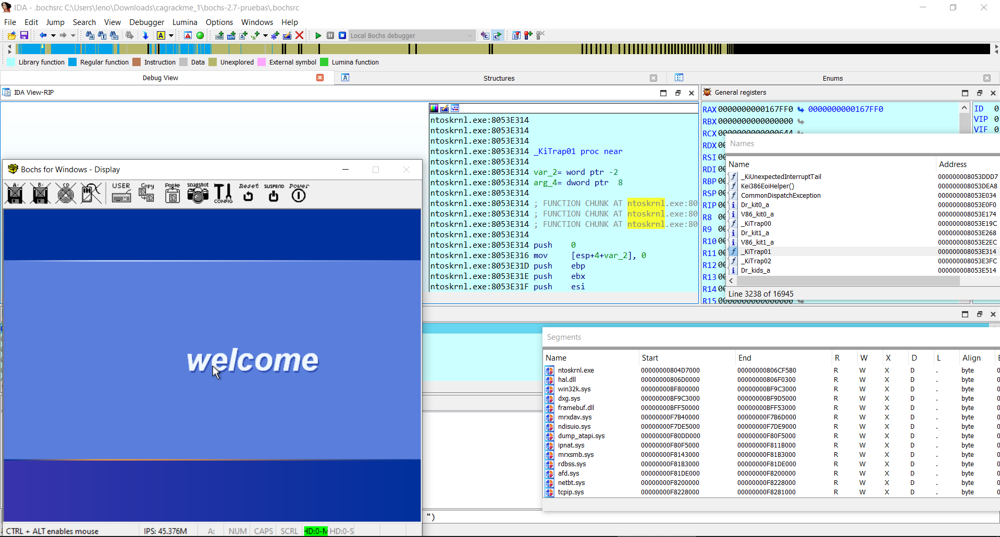
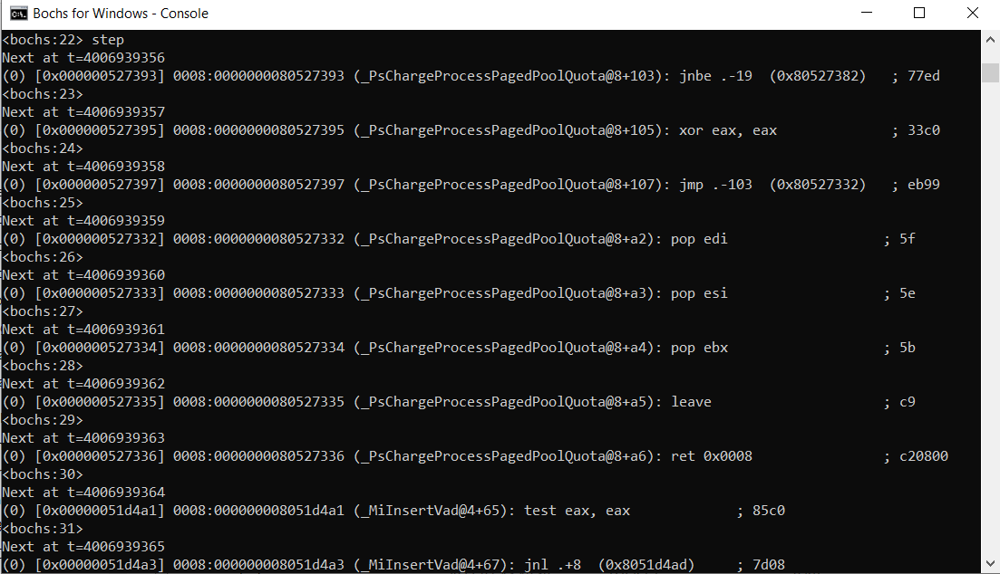
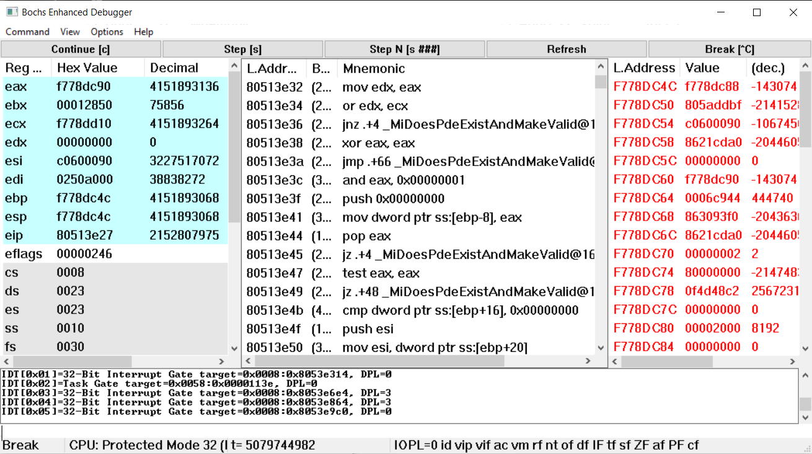
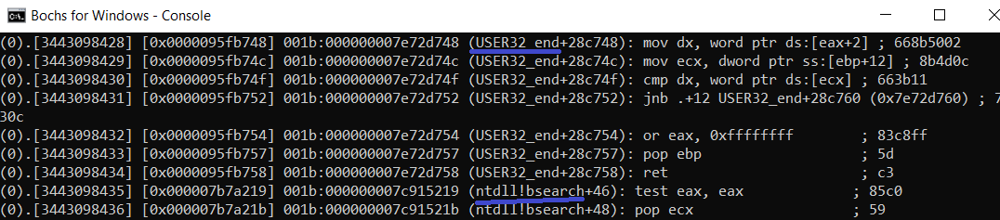

# ida_bochs_windows
Helper script for Windows kernel debugging with IDA Pro on native Bochs debugger (including PDB symbols)

python3 + idapython 7.4



Bochs debugger:



Bochs debugger GUI:



# Usage

**WARNING**: BEFORE OPEN IDA your must set env var: _NT_SYMBOL_PATH to windows symbols, ex: 
```
SRV*C:\winsymbols*
```` 

Open IDA PRO, start a debug session and go to File -> Script File -> ida_bochs_windows.py

Done!

## Export IDA Names to file for raw Bochs debug

1. Open IDA PRO, start a debug session and go to File -> Script File -> ida_bochs_windows.py
2. Execute ida_names_to_bochs_sym.py
3. Select a file to save info

Use the generated file in Bochs debugger (ldsym global + file path), example:

```
ldsym global "C:\\Users\\Dreg\\bochs\\bochs_syms.txt"
```

## Export IDA Segments to file for raw Bochs debug

1. Open IDA PRO, start a debug session and go to File -> Script File -> ida_bochs_windows.py
2. Execute ida_segs_to_bochs_sym.py
3. Select a file to save info

Use the generated file in Bochs debugger (ldsym global + file path), example:

```
ldsym global "C:\\Users\\Dreg\\bochs\\bochs_segs.txt"
```

## Join bochs_segs.txt and bochs_syms.txt

It can be useful have segments + symbols together:

```
type bochs_segs.txt > bochs_segs_and_syms.txt
type bochs_syms.txt >> bochs_segs_and_syms.txt
```

Now, when a instruction its out of a known segment its easy to view:



## Demo video

https://youtu.be/X8bJ421iaVA

## Related 

Helper script for Windows kernel debugging with IDA Pro on VMware + GDB stub (including PDB symbols):
- https://github.com/therealdreg/ida_vmware_windows_gdb

Helper scripts for windows debugging with symbols for Bochs and IDA Pro (PDB files). Very handy for user mode <--> kernel mode:
- https://github.com/therealdreg/symseghelper

Helper script for Linux kernel debugging with IDA Pro on VMware + GDB stub (including some symbols helpers):
- https://github.com/therealdreg/linux_kernel_debug_disassemble_ida_vmware

Dump PDB Symbols including support for Bochs Debugging Format (with wine support):
- https://github.com/therealdreg/pdbdump_bochs

## Credits

Based on original IDA-VMware-GDB By Oleksiuk Dmytro (aka Cr4sh) https://github.com/Cr4sh/IDA-VMware-GDB
